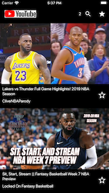
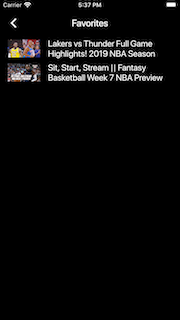

# flutter-youtube
A sample application written with flutter to allow search and playback of Youtube videos
This application was written as part of the Flutter development course available in [Udemy's platform](https://www.udemy.com/course/curso-completo-flutter-app-android-ios).

# Running
In order to test this application, insert your Youtube's API key in [`youtube_app/lib/api.dart`](youtube_app/lib/api.dart) file.

# Screens

# Concepts
This application applies the concepts of BLoC in Flutter [Ref 1](http://flutterdevs.com/blog/bloc-pattern-in-flutter-part-1/) [Ref 2](https://www.raywenderlich.com/4074597-getting-started-with-the-bloc-pattern).

# Dependencies
Used dependencies and versions:
* [flutter_youtube](https://pub.dev/packages/flutter_youtube) v2.0.0
* [shared_preferences](https://pub.dev/packages/shared_preferences) v0.5.4+6
* [http](https://pub.dev/packages/http) v0.12.0+2
* [rxdart](https://pub.dev/packages/rxdart) v0.22.6
* [bloc_pattern](https://pub.dev/packages/bloc_pattern) v.2.5.1

